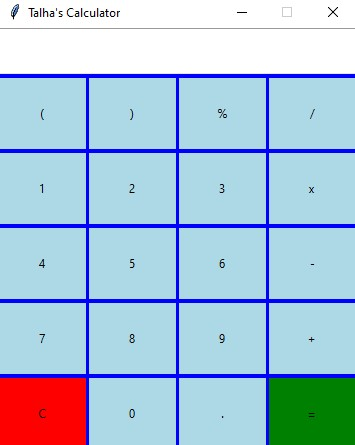

# 🧮 Calculator with Tkinter

A sleek, modern, and user-friendly desktop calculator built with Python and Tkinter. This application provides all the basic arithmetic operations in an intuitive graphical interface, making it a perfect example of a beginner-to-intermediate Python GUI project.


---

## 📋 Table of Contents

- [Overview](#overview)
- [Features](#features)
- [Screenshots](#screenshots)
- [Installation](#installation)
- [Usage](#usage)
- [Project Structure](#project-structure)
- [Code Overview](#code-overview)
- [Dependencies](#dependencies)
- [Contributing](#contributing)
- [License](#license)
- [Developer](#developer)

---

## 🚀 Overview

This project is a fully functional graphical calculator that mimics the core functionality of a standard calculator. It's built entirely in Python using the built-in Tkinter library for the graphical user interface, demonstrating key concepts of event-driven programming, widget management, and layout design.

## ✨ Features

- **Basic Arithmetic Operations**: Addition (`+`), Subtraction (`-`), Multiplication (`*`), and Division (`/`).
- **Clear Functionality**: A dedicated `C` button to reset the calculation.
- **Equals Operation**: The `=` button evaluates the expression and displays the result.
- **User-Friendly Interface**:
    - A clean, modern dark theme.
    - Large, easy-to-read display.
    - Responsive buttons with visual feedback.
- **Error Handling**: Gracefully handles common errors like division by zero.

## 🖼️ Screenshots

### Main Application Window


## 💻 Installation

To run this calculator on your local machine, follow these steps:

### Prerequisites
- **Python 3.6 or higher** must be installed on your system.
- You can download it from [python.org](https://www.python.org/downloads/).

### Steps
1.  **Clone the repository**:
    ```bash
    git clone https://github.com/DeadboyTALHA/Calculator-with-Tkinter.git
    ```
2.  **Navigate to the project directory**:
    ```bash
    cd Calculator-with-Tkinter
    ```
3.  **Run the application**:
    ```bash
    python Talha's Calculator.py
    ```
    *If the above command doesn't work, try `python3 Talha's Calculator.py`.*

## 🎮 Usage

1.  Launch the application by running `Talha's Calculator.py`.
2.  Use your mouse to click on the number buttons (`0-9`) to input digits.
3.  Select an operation button (`+`, `-`, `*`, `/`).
4.  Continue entering the second number.
5.  Press the `=` button to see the result of the calculation.
6.  Press the `C` button at any time to clear the display and start a new calculation.

## 📁 Project Structure

```
Calculator-with-Tkinter/
│
├── Talha's Calculator.py      # The main source code file for the calculator application.
├── README.md          # Project documentation (this file).
└── .gitignore         # Specifies files intentionally untracked by Git.
```

## 🔍 Code Overview

### Main Components (`calculator.py`)

The application is structured within a single Python script:

- **`Calculator` Class**: The main class that initializes the GUI and handles the application logic.
- **GUI Initialization (`__init__`)**:
    - Creates the main application window (`Tk`).
    - Sets up the title, geometry, and resizability.
    - Configures a modern dark theme for all widgets.
- **Widget Creation**:
    - **Display**: An `Entry` widget used as a read-only display for numbers and results.
    - **Button Frame**: A `Frame` to hold all the calculator buttons.
    - **Buttons**: Dynamically created buttons for digits, operators, and actions, arranged in a grid layout.
- **Core Methods**:
    - `button_click(number)`: Appends clicked numbers and operators to the current expression in the display.
    - `button_clear()`: Clears the display field.
    - `button_equal()`: Evaluates the mathematical expression in the display using `eval()` and shows the result or an error message.

### Key Logic
- The current expression is built as a string in the `Entry` widget.
- The `eval()` function is used to compute the result when the `=` button is pressed, which is a simple and effective approach for this scope of project.
- Basic error handling catches exceptions (like division by zero) and displays "Error".

## 📦 Dependencies

This project uses only Python's standard library, requiring no external packages.

| Module | Purpose |
| :--- | :--- |
| `tkinter` | To create the Graphical User Interface (GUI). |

## 🤝 Contributing

Contributions, issues, and feature requests are welcome! Feel free to check the [issues page](https://github.com/DeadboyTALHA/Calculator-with-Tkinter/issues) (if available).

1. Fork the Project.
2. Create your Feature Branch (`git checkout -b feature/AmazingFeature`).
3. Commit your Changes (`git commit -m 'Add some AmazingFeature'`).
4. Push to the Branch (`git push origin feature/AmazingFeature`).
5. Open a Pull Request.

## 📄 License

This project is licensed under the MIT License. See the [LICENSE](LICENSE) file for details.

## 👨‍💻 Developer

**Talha**

- GitHub: [@DeadboyTALHA](https://github.com/DeadboyTALHA)

---

**⭐ Star this repo if you found it helpful!**

---
